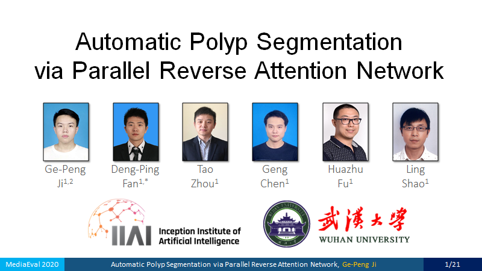

<p align="center">
  <a href="xxxx">Arxiv Preprint (Upcoming)</a> |
  <a href="https://youtu.be/ukJKJosu1f8">Presentation Video on YouTube</a>
</p>

<p align="center">
  <a href="[xxxx](https://scholar.google.com/citations?user=oaxKYKUAAAAJ&hl=en)">Ge-Peng Ji</a> |
  <a href="https://dpfan.net/">Deng-Ping Fan*</a> |
  <a href="https://taozh2017.github.io/">Tao Zhou</a> |
  <a href="https://www.researchgate.net/profile/Geng_Chen13">Geng Chen</a> |
  <a href="http://hzfu.github.io/">Huazhu Fu</a> |
  <a href="http://www.inceptioniai.org/">Ling Shao</a>
</p>

## :boom: News :boom:

- Traning code will be update before the virtual conference

- Testing dataset will be update after the release of official link by workshop organizer

## 1. Brief Description

In this paper, we present a novel deep neural network, termed Parallel Reverse Attention Network 
(_PraNet_), for the task of automatic polyp segmentation at MediaEval 2020. We give the brif description here:

**Technical Details.** Specifically, we first aggregate the features in high-level layers using a parallel partial
decoder (PPD). Based on the combined feature, we then generate a
global map as the initial guidance area for the following components.
In addition, we mine the boundary cues using the reverse
attention (RA) module, which is able to establish the relationship
between areas and boundary cues. 

**High Performance and Efficiency.** Thanks to the recurrent cooperation
mechanism between areas and boundaries, our PraNet is
capable of calibrating misaligned predictions, improving the segmentation
accuracy and achieving real-time efficiency (30fps) on
a single NVIDIA GeForce GTX 1080 GPU.

**Training Strategy.** We introduce different 
data augmentation strategies into the dataloader, such as random horizontal flipping, rotating, 
color enhancement and border cropping. These strategies is able to enhance the capability and generalizability 
of the model in the practial scene.

## 2. Usage

### 2.1. Prerequisites of Environment

I recommend that you enter the commands step-by-step in the terminal, due to different machine may encounter some problems.

```bash
#!/usr/bin/env bash

# confirm your server have install `anaconda`
# (NOTE: in this phase, you need confirm the installation via enter `Y` manually)
conda create -n pranet python=3.6

# activate your virtual environment
# (NOTE: if this step is invalid, you must activate it manually)
conda activate pranet

# install necessary packages for PyTorch
# (NOTE: in this phase, you need confirm the installation via enter `Y` manually)
conda install pytorch=1.3.1 torchvision=0.4.2 cudatoolkit=10.0

# install necessary packages for necessary libs
pip install opencv-python==3.4.2.17 tensorboardX==2.0
```

### 2.2. Training

- We randomly select train/validation (90% / 10%) samples from [Kavasir-SEG dataset](https://datasets.simula.no/kvasir-seg/).

### 2.3. inference

- Following the protocol defined in the workshop instructions, we prepare the test set. (Note that we do not have 
ground-truth until now, and we will update it later)

- Download the model weights from [google drive](https://drive.google.com/file/d/1cbJ5dh-Vcat6TfWvZ1ziZJdKyVHT0fAW/view)

- Put it into `./snapshot/Net_epoch_best.pth`

- Run `python Testing.py`

## 3. Citation

If you find the code and dataset useful in your research, please consider citing:

    @article{fan2020pra,
        title={PraNet: Parallel Reverse Attention Network for Polyp Segmentation},
        author={Fan, Deng-Ping and Ji, Ge-Peng and Zhou, Tao and Chen, Geng and Fu, Huazhu and Shen, Jianbing and Shao, Ling},
        journal={MICCAI},
        year={2020}
    }
    
    @article{ji2020automatic,
        title={Automatic Polyp Segmentation via Parallel Reverse Attention Network},
        author={Ji, Ge-Peng and Fan, Deng-Ping and Zhou, Tao and Chen, Geng and Fu, Huazhu and Shao, Ling},
        journal={MedicalEval Workshop},
        year={2020}
    }

## 4. Acknowledgements

This repo is submitted to the workshop at Medico Automatic Polyp Segmentation Challenge 2020. Note that this work is the
 extension of our previous paper published at MICCAI-2020. More information refer to
our original paper ([Project](https://link.springer.com/chapter/10.1007%2F978-3-030-59725-2_26), 
[Paper](https://link.springer.com/chapter/10.1007%2F978-3-030-59725-2_26), 
[Chinese Traslation](http://dpfan.net/wp-content/uploads/MICCAI20_PraNet_Chinese.pdf), and
[Code](https://github.com/DengPingFan/PraNet)). For more questions, please feel free to contact me via [e-mail](gepengai.ji@gmail.com).
